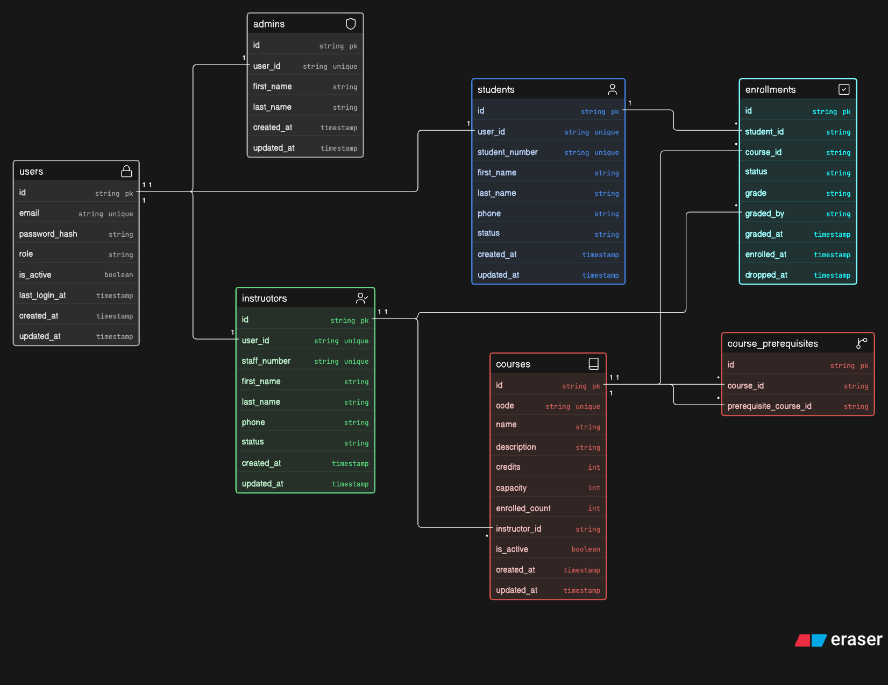

# Course Management System

## Overview
Course management system allow student register and manage their courses in GA 

## Screenshots

## Technologies Used
- HTML
- CSS
- JavaScript
- MongoDB
- Express.js
- EJS

## Getting Started

## Installation

## User Stories

## CREATE

* As an admin, I want to create a new course with a code, name, credit hours, and department so that students can enroll in it.
* As a student, I want to enroll in an available course so that it appears in my schedule.
* As an admin, I want to add an instructor and assign them to courses so that each course has a teacher.

## READ

* As a student, I want to browse all available courses so that I can decide what to enroll in.
* As a student, I want to search courses by name or code and filter by department or semester so that I can find courses quickly.
* As a user, I want to open a single course to see its description, prerequisites, schedule, and enrolled count.
* As a student, I want to see a list of my current enrollments so that I know my schedule.
* As an instructor, I want to see the list of students enrolled in my course so that I can track attendance.

## UPDATE

* As an admin, I want to update a course's name, credits, capacity, or schedule so that the catalog stays accurate.
* As a student, I want to edit my email and contact info so that my records stay current.
* As an admin, I want to change the instructor assigned to a course so that staffing changes are reflected.
* As an instructor, I want to enter or update grades for enrolled students so that results are recorded.

## DELETE

* As an admin, I want to remove a course from the catalog so that discontinued courses aren't offered.
* As a student, I want to drop a course I'm enrolled in so that it's removed from my schedule.
* As an admin, I want to delete a student record so that inactive students are cleared.
* As an admin, I want to delete an instructor so that former staff aren't listed.

CROSS-CUTTING

* As a user, I want to log in with my credentials so that I only see what my role permits.

## Database Design

## Routes

## Routes

## Routes

| Method | Route | Description |
|--------|-------|-------------|
| GET | `/` | Home page |

### Auth

| Method | Route | Description |
|--------|-------|-------------|
| GET | `/auth/sign-up` | Sign-up form |
| POST | `/auth/sign-up` | Create user account |
| GET | `/auth/sign-in` | Sign-in form |
| POST | `/auth/sign-in` | Log user in |
| GET | `/auth/sign-out` | Log user out |

### Courses

| Method | Route | Description |
|--------|-------|-------------|
| GET | `/courses` | List/search/filter all courses |
| GET | `/courses/new` | New course form (admin) |
| POST | `/courses` | Create course (admin) |
| GET | `/courses/:id` | View course details |
| GET | `/courses/:id/edit` | Edit course form (admin) |
| PUT | `/courses/:id` | Update course (admin) |
| DELETE | `/courses/:id` | Delete course (admin) |

### Enrollments

| Method | Route | Description |
|--------|-------|-------------|
| GET | `/enrollments` | My enrollments (student) |
| POST | `/courses/:id/enrollments` | Enroll in course (student) |
| DELETE | `/enrollments/:id` | Drop course (student) |
| GET | `/enrollments/:id/grade` | Grade entry form (instructor) |
| PUT | `/enrollments/:id/grade` | Enter/update grade (instructor) |

### Students

| Method | Route | Description |
|--------|-------|-------------|
| GET | `/students` | List all students (admin) |
| GET | `/students/:id` | View student profile |
| GET | `/students/:id/edit` | Edit profile form |
| PUT | `/students/:id` | Update student info |
| DELETE | `/students/:id` | Delete student (admin) |

### Instructors

| Method | Route | Description |
|--------|-------|-------------|
| GET | `/instructors` | List all instructors |
| GET | `/instructors/new` | New instructor form (admin) |
| POST | `/instructors` | Create instructor (admin) |
| GET | `/instructors/:id` | View instructor profile |
| GET | `/instructors/:id/edit` | Edit instructor form (admin) |
| PUT | `/instructors/:id` | Update instructor (admin) |
| DELETE | `/instructors/:id` | Delete instructor (admin) |

## Features

- **Authentication and sessions**
  - Sign up, sign in, and sign out with encrypted passwords using bcrypt.
  - Persistent MongoDB-backed sessions with role-aware navigation.

- **Role-based access**
  - Student, instructor, and admin roles with different navigation and permitted actions.
  - Protected management, enrollment, and grading routes.

- **Course management**
  - Browse the course catalog and open detailed course pages.
  - View course descriptions, credits, capacity, enrolled count, and assigned instructor.
  - Admins can create, edit, assign instructors and prerequisites to, and deactivate courses.

- **Instructor management**
  - Browse instructors and view their profiles and assigned courses.
  - Admins can create, edit, and deactivate instructor records.

- **Student management**
  - Admins can browse student records and view student profiles and current courses.
  - Admins can edit student information and mark students as inactive.

- **Enrollment and grading**
  - Students can enroll in available courses and drop existing enrollments.
  - Prerequisite eligibility is shown on course pages and enforced before enrollment.
  - Instructors can view course rosters and enter or update student grades.
  - Grade pages display the student, course, and current grade before saving changes.

- **User interface**
  - Responsive CourseHub navigation with role-specific sidebar links.
  - Reusable confirmation dialogs for course, instructor, student, and enrollment deletion actions.
  - Semantic HTML structure, responsive cards, forms, tables, and a CourseHub favicon.

- **Application reliability**
  - Route-level error handling with temporary console logging for database results and errors.
  - Soft deletion preserves historical course, instructor, student, and enrollment records.

## Future Enhancements

- Add corequisite course requirements to enrollment eligibility.

## Credits

- Mr. Omar — project guidance and instruction.
- Bootstrap — interface design and styling components.
